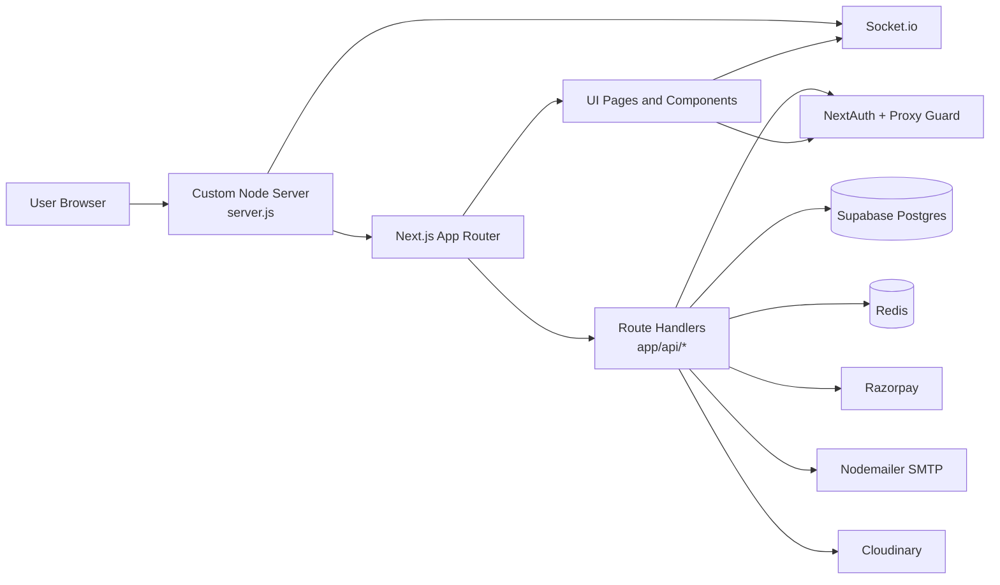

# MessMate

MessMate is a full-stack mess management platform built with Next.js App Router. It serves three primary user groups: consumers, mess owners, and administrators. The application combines authenticated workflows, order and subscription handling, mess onboarding, review flows, notifications, analytics, and operational controls in one codebase.

This README is written as the current project source of truth. It reflects the present app structure, runtime, integrations, and local setup expectations.

## What The Platform Does

MessMate is designed to manage the complete lifecycle of a mess business:

- Consumers discover messes, subscribe to meals, place bookings, manage profile data, and view booking history.
- Mess owners register new messes, manage menu and profile details, track orders, verify customers, and review analytics.
- Administrators verify messes, monitor users, review reports, and manage moderation workflows.

The application also includes supporting flows such as password reset, notifications, keepalive endpoints, and secret/admin registration routes for internal onboarding.

## Product Capabilities

### Consumer Experience

- Browse mess listings and inspect mess details.
- Book meals and handle Razorpay-powered payments.
- View history, daily mess activity, and personal account information.
- Receive notifications and transaction-related updates.
- Edit consumer information or delete an account when needed.

### Mess Owner Experience

- Register a new mess and submit it for verification.
- Update mess information, menu data, and operating details.
- Track orders, manage customer registrations, and view messaging-related activity.
- Access analytics for operational insight.
- Review mess details and maintain the owner dashboard.

### Admin Experience

- Review pending mess registrations and verify or reject submissions.
- Browse all messes and all users from centralized admin screens.
- Open individual mess and user records for moderation.
- Warn or block misbehaving accounts through dedicated admin API routes.
- Access pending verification queues and system-level oversight views.

## Architecture Overview

The project uses a custom Node.js HTTP server that boots Next.js and attaches Socket.io for real-time updates. Most business logic is implemented through App Router pages and route handlers under `app/api`, with shared integrations in `lib` and presentation components in `Component` and `components`.



### Runtime Flow

1. `server.js` creates the HTTP server and prepares Next.js.
2. Socket.io is initialized on the same server for live notifications and event delivery.
3. App Router pages render the user interfaces for consumer, owner, and admin roles.
4. API routes handle authentication, booking, verification, notifications, and account workflows.
5. Shared libraries centralize Supabase access, Redis caching, base URL resolution, and request validation.

## Repository Structure

### App Router

- `app/` contains all application routes, layouts, and route handlers.
- `app/(auth)/` contains login, signup, forgot password, and reset password pages.
- `app/admin/` contains admin dashboards, verification queues, and user or mess listings.
- `app/consumer/` contains consumer profile and history pages.
- `app/mess/` contains mess-facing views, booking flows, and status pages.
- `app/owner/` contains owner dashboards, analytics, and mess management screens.
- `app/notifications/` contains the notification inbox.
- `app/register-owner/` and `app/secret/register-admin/` support onboarding and internal admin registration.
- `app/api/` contains all server route handlers for authentication, booking, admin actions, consumer flows, keepalive, socket support, notifications, and owner workflows.

### Shared UI And Logic

- `Component/` contains the feature-driven UI pieces grouped by domain such as Admin, Auth, Consumer, IndividualMess, and Owner.
- `components/ui/` contains reusable UI primitives.
- `contexts/` holds React context providers such as notifications.
- `hooks/` contains client-side reusable hooks.
- `lib/` contains service clients, server utilities, socket bootstrapping, Redis helpers, validation helpers, and base URL logic.
- `validators/` contains Zod-style or schema-based input validation modules.

### Platform Files

- `server.js` is the custom runtime entry point.
- `proxy.ts` protects routes and checks authentication state.
- `next.config.ts` configures allowed origins and app behavior.
- `vercel.json` supports deployment defaults for Vercel.
- `Dockerfile` supports containerized deployment.

## Technology Stack

### Frontend

- Next.js 16 App Router
- React 19
- Tailwind CSS 4
- Radix UI primitives
- Framer Motion for motion design
- Recharts for charts and analytics
- Lucide React and React Icons for iconography

### Backend And Infrastructure

- Next.js route handlers and custom HTTP server
- Supabase Postgres for data storage and auth-adjacent access patterns
- NextAuth for session and token handling
- Redis for caching and application state support
- Socket.io for live notifications and event pushes
- Razorpay for payments
- Nodemailer for transactional email
- Cloudinary for image and media upload handling

## Key Integrations

### Supabase

Supabase is the primary database integration. Both browser-side and server-side clients are configured through shared utilities in `lib/`. Server-side access uses privileged credentials where needed, while browser access uses the public key.

### Authentication

Authentication is implemented with NextAuth and guarded routes via `proxy.ts`. Reset-password and forgot-password flows are handled through dedicated API routes.

### Payments

Razorpay is used for mess booking and subscription payment flows. The booking routes support payment order creation and verification logic.

### Realtime Notifications

Socket.io is mounted in the custom server and used by the notification context to enable live updates where sockets are enabled.

### Caching

Redis is used as an optional performance layer. When Redis is unavailable, the application is designed to continue operating with fallback behavior.

## Local Development

### Prerequisites

- Node.js 18 or newer
- npm
- A Supabase project
- A Redis instance if you want cache-backed behavior locally
- Razorpay credentials for payment flows
- SMTP credentials for email flows
- Cloudinary credentials for media uploads

### Install Dependencies

```bash
npm install
```

### Environment Variables

Create a `.env.local` file in the project root and provide the values required by your setup.

```bash
NEXTAUTH_SECRET=
NEXTAUTH_URL=http://localhost:3000
NEXT_PUBLIC_BASE_URL=http://localhost:3000

SUPABASE_URL=
NEXT_PUBLIC_SUPABASE_URL=
SUPABASE_SERVICE_ROLE_KEY=
NEXT_PUBLIC_SUPABASE_PUBLISHABLE_KEY=

REDIS_URL=
NEXT_PUBLIC_ENABLE_SOCKETS=false

RAZORPAY_KEY_ID=
RAZORPAY_SECRET=
NEXT_PUBLIC_RAZORPAY_KEY_ID=

MAIL_USER=
MAIL_PASS=

CLOUD_NAME=
CLOUD_API_KEY=
CLOUD_API_SECRET=

PORT=3000
ALLOWED_DEV_ORIGINS=http://localhost:3000
```

Notes:

- `SUPABASE_SERVICE_ROLE_KEY` must remain server-only.
- `REDIS_URL` is optional. If omitted, the app should continue without Redis-backed caching.
- `NEXT_PUBLIC_ENABLE_SOCKETS` can be used to disable socket activity in browser contexts when required.
- Some routes read fallback names for payment and mail configuration, so keep the canonical variables consistent in your environment.

### Run The App

```bash
npm run dev
```

### Production Build

```bash
npm run build
npm run start
```

## Available Scripts

- `npm run dev`: starts the custom Node server in development mode.
- `npm run build`: creates the production Next.js build.
- `npm run start`: starts the production server.
- `npm run lint`: runs ESLint across the codebase.
- `npm run test:auth`: runs authentication-focused tests.
- `npm run test:e2e-auth`: runs end-to-end authentication tests.

## Operational Notes

- The app uses a custom server instead of the default Next.js runtime entry point because Socket.io is attached at startup.
- Route-level validation is centralized through the `validators/` directory and shared server helpers.
- Notifications are split between database-backed state and realtime delivery.
- Admin and owner flows are intentionally separated so the UI and API surface can evolve independently by role.

## Deployment

The project is compatible with containerized and platform-based deployment.

- `Dockerfile` supports building a container image.
- `vercel.json` supports Vercel deployment behavior.
- Set the production environment variables in the target platform before deployment.
- Ensure the base URL, auth URL, and origin allowlist are aligned with the deployed hostname.

## Contributing

1. Create a branch for the change.
2. Implement the update and verify it locally.
3. Run the relevant lint or test command.
4. Open a pull request with a concise summary of the change.

## Suggested Project Summary

MessMate is a role-based mess management system for consumers, owners, and admins. It combines bookings, payments, verification, notifications, analytics, and operational moderation in a single Next.js application.
